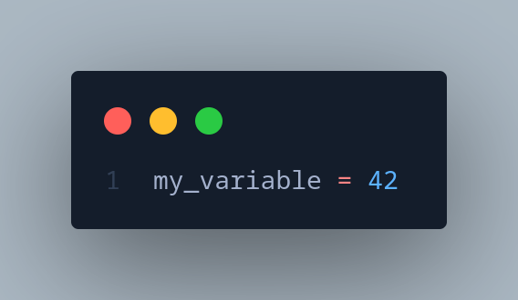
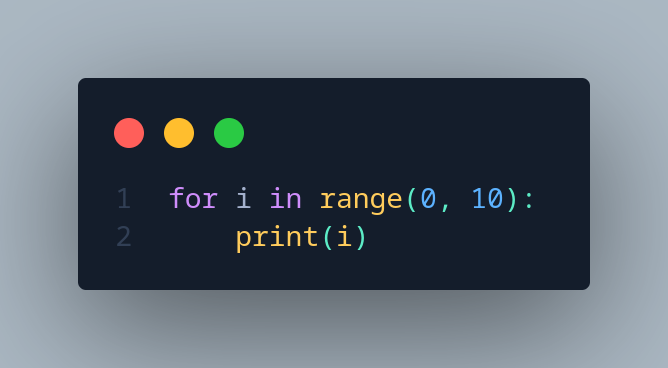
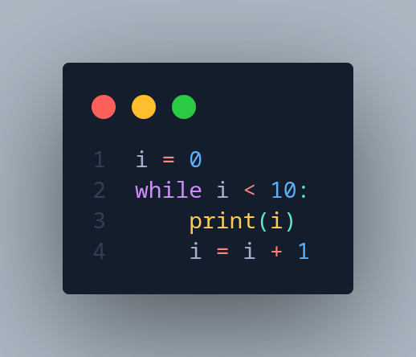
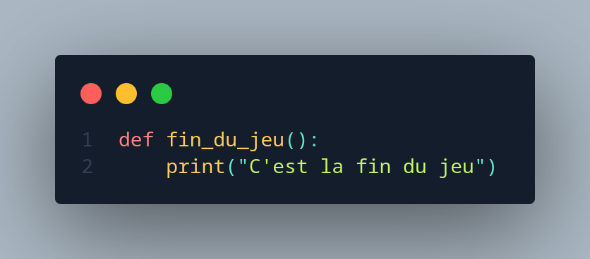
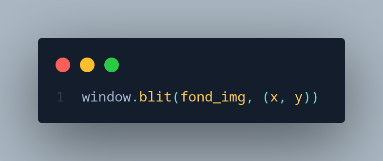

# GEOMETRY DASH

# Présentation du projet :
Bonjour !

Lors de ce coding club, nous allons reproduire une version simplifiée du jeu
Geometry Dash (un jeu mobile associant musique et réflexes) !

Pour cela, nous utiliserons comme technologie, le langage de programmation nommé “Python” avec sa librairie spécialisée pour les jeux-vidéos : Pygame.

Afin de mener à bien la réalisation de ce jeu, nous avons décidé de la diviser en plusieurs étapes,
disponibles via plusieurs fichiers nommés en fonction de celles-ci (exemple : step1.py).

Durant ce coding club, vous allez donc apprendre à manipuler des variables, à utiliser des classes et des fonctions. Tout cela pour pouvoir ouvrir une fenêtre, afficher des images dans cette fenêtre, bouger ces images et utiliser des évènements.

# Rappels ou bases sur le python
- **Variable**

    

    - Une **donnée** de notre programme.

    - Comme son nom l’indique cette donnée peut **varier** au cours de l’exécution du programme

        - Exemple : la position du joueur (self.rect.x = 10)
- **Condition**

    - Permet d’exécuter une partie d’un programme sous une certaine condition
        - Exemple : Faire sauter le joueur si l’utilisateur appuie sur la touche Espace (if ... :)
- **Boucle**

    
    

    - Permet d’exécuter des actions en boucle.
        - Exemple : tant que le joueur n’a pas fermé la fenêtre du jeu, exécute le code du jeu.
- **Fonction**

    

    - Permet de regrouper plusieurs instructions de notre programme en une seule
instruction réutilisable.
        - Exemple : Une fonction permettant d’afficher au joueur que c’est la fin du jeu. (def display(): )

# <u>Etape 0 : Ouverture d’une fenêtre, afficher un arrière-plan et le sol</u>

- Ouvrir une fenêtre
    - window_width : 600 pixels
    - window_height : 768 pixels

- Afficher le sol
Vous devez ici afficher le sol de la même façon que l’arrière-plan comme présenter ci-
dessous :
    - Utiliser .blit() pour afficher une image.

        

- Cependant, vous devez le placer aux coordonnées suivantes :
    - x = 0
    - y = (window_height - window_width)

# <u>Etape 1 : Création d’un joueur et modifier sa position</u>

- Pour cette étape on va devoir charger l'image, inspirez-vous des deux variables "font_image" et "sol_image" mais avec l'image "cube.png".
    - Une fois ceci effectué, assigner cette variable à self.image

- Vous devez initialiser une variable nommée “cube”, qui correspond à
notre joueur et ainsi modifier sa position de sorte à ce qu’il soit sur le sol.

- Créer des variables pour stocker les positions du player.

# <u>Etape 2 : Déplacer le sol et l’arrière-plan</u>

Stocker la position du sol

- Vous devez ici initialiser la position x du sol à la largeur de l’image.

Faire déplacer le sol

 - Déplacer le sol de la même façon que l’arrière-plan, avec les variables correspondantes présentes dans l’étape précédente.

# <u>Etape 3 : Création d’un saut</u>

Actualiser la variable de saut et jouer le son de saut

Lorsque l’utilisateur appuie sur la touche espace, la variable de saut nommée “jump” doit
être actualisé à “True” pour indiquer au programme que l’utilisateur a demandé d’effectuer
la fonction de saut.
Vous devez également, lorsque la variable “jump” est à “True”, jouer un son que nous
avons initialisé auparavant accessible grâce à la variable “jump_sound”.

- Définir la hauteur du saut (10)

- Jouer le son avec la methode .play()

# <u>Etape 4 : Afficher et faire bouger un obstacle</u>

Initialiser la position de l’obstacle

- Exactement comme le joueur, initialisez votre obstacle à hauteur du sol.

Déplacer l’obstacle de gauche à droite

- Afin que le joueur puisse perdre s'il touche un obstacle, déplacer l’obstacle de la vitesse que
vous souhaitez (nous vous conseillons 10), et pensez également à le faire réapparaître
lorsque celui-ci sort de la largeur de l’écran en modifiant sa valeur x.

# <u>Etape 5 : Collision et score</u>

Modifier la fonction finDuJeu

- Comme son nom l’indique, cette fonction sera appelée lorsque l’utilisateur a perdu si celui-
ci a touché un obstacle. On vous demande donc ici d’ajouter un son lorsque l’utilisateur a
perdu grâce à une variable que nous avons initialisé nommée "game_over_sound”.

- Appeler la fonction

    - Une fois cette fonction complétée, il ne vous reste plus qu’à l’implémenter lorsqu’il a eu une
collision.

Modifier la classe obstacle

- Maintenant que le player peut recommencer, il faut maintenant augmenter son score
    - Ajouter une condition lorsque l'obstacle est entre 45 et 50 en x, incrémenter le score de 1.

# BONUS

Maintenant que vous avez fini, vous pouvez faire certains bonus.

Si vous n'avez pas d'idées nous vous en proposons plusieurs :

- un menu
- un restart
- un meilleur niveau
